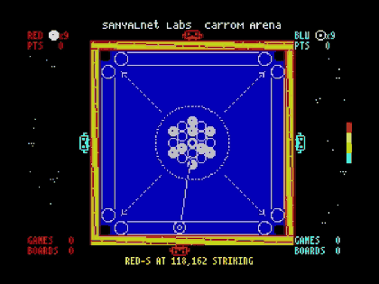

# ZX CARROM for the 48K Sinclair ZX Spectrum



ZX CARROM is a fast-loading **carrom board game for the 48K Sinclair ZX Spectrum**. It brings striker shots, coin pocketing, queen-cover drama, match scoring, and four robot players to a machine with 48K of RAM and absolutely no patience for wasted bytes. The final release is a turbo-loaded **[TZX tape image](dist/zxcarrom.tzx)** for ZX Spectrum 48K systems and emulators. You can **[play ZX CARROM online](https://tuklusan.github.io/zx-spectrum-emulator/?tape=https%3A%2F%2Fraw.githubusercontent.com%2Ftuklusan%2FZX-Carrom%2Fmain%2Fdist%2Fzxcarrom.tzx&autoload=1)** or **[visit the itch.io release page](https://tuklusan.itch.io/zx-carrom)**.

<br clear="left"/>

## Build

The build starts here; one Python script gets the glamorous job of doing everything:

```bash
python3 build.py
```

It builds the game with Pasmo, checks the result, and writes the finished tape image to **[`dist/zxcarrom.tzx`](dist/zxcarrom.tzx)**.

## Gameplay video

https://github.com/user-attachments/assets/133e01c4-a87e-4184-9d19-2e5dcc98a211

<p align="center"><strong><a href="https://youtu.be/ZcC83rU1Icw">▶ Watch on YouTube</a></strong></p>

## Technical description

Under the bonnet, ZX CARROM is mostly hand-written **Z80 assembly**, with a little **Python** doing the chores: making the loading screen, checking memory limits, putting the loader together, building the TZX, and giving the finished tape one last poke.

The game is made for the **Sinclair ZX Spectrum 48K**, a computer that treats spare memory as a character flaw. Somehow, all this still fits:

- a turbo-loaded loading screen followed by the game from the same TZX;
- a full carrom board with striker, queen, white and black coins, pockets, rebounds, scoring, returns, and Due handling;
- four autonomous robot player styles with turn handling, shot planning, and queen-cover awareness;
- match, board, and points counters designed to stay readable on a Spectrum screen;
- continuous 1-bit game music, short effects, and nanobeep-family title/result audio; and
- one release file: **[`dist/zxcarrom.tzx`](dist/zxcarrom.tzx)**.

The build uses **[Pasmo](https://github.com/tuklusan/pasmo)** to assemble the source as-is, then builds the loader/bootstrap, makes the Spectrum loading screen, and writes the final TZX. Quite a lot happens before the first coin moves, which is traditional for both software and actual carrom tournaments.

## License

(c) 2026 Supratim Sanyal of SANYALnet Labs. Proprietary rights reserved except as expressly licensed. Attribution Required.

See **[`LICENSE`](LICENSE)**. Third-party notices are in **[`THIRD_PARTY_LICENSES.txt`](THIRD_PARTY_LICENSES.txt)** and **[`loader/ZQLOADER_LICENSE.txt`](loader/ZQLOADER_LICENSE.txt)**.
